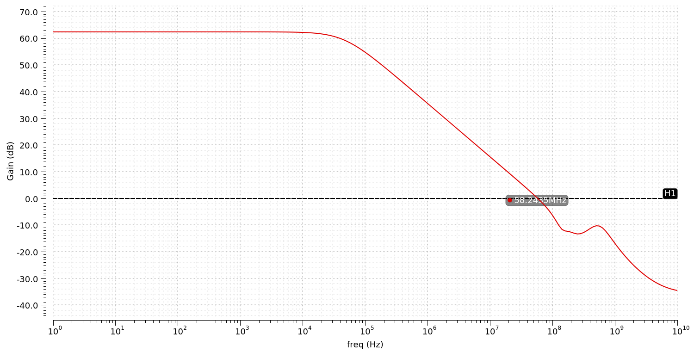
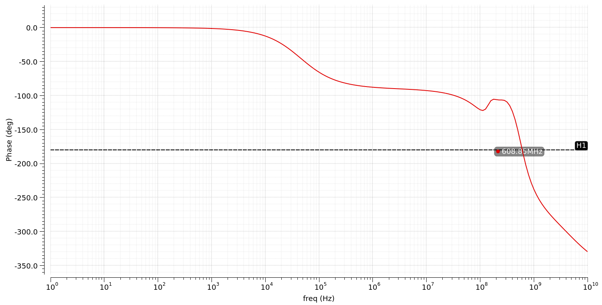
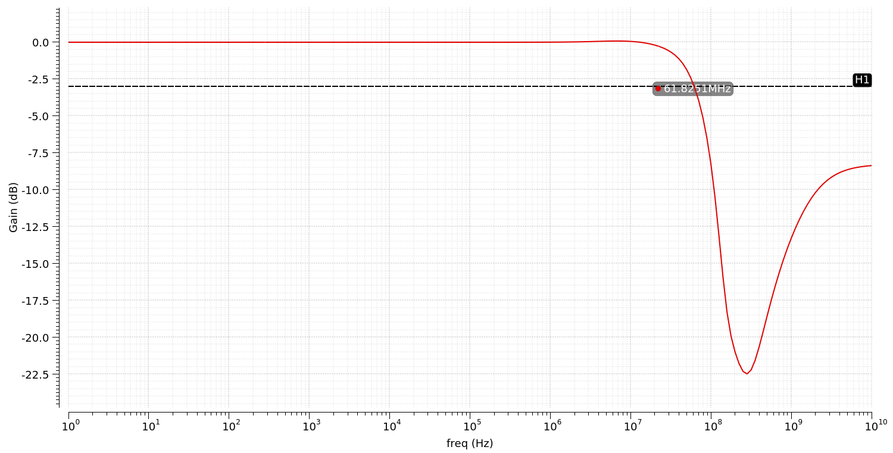
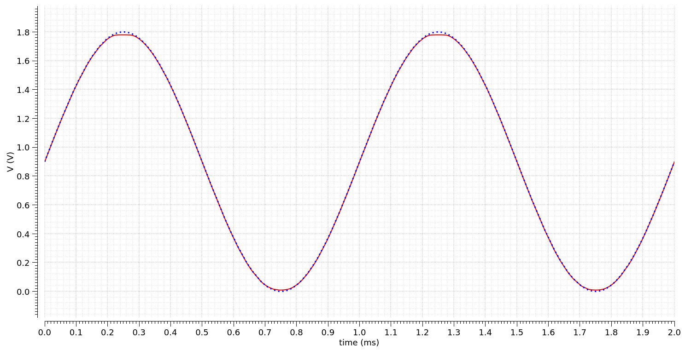
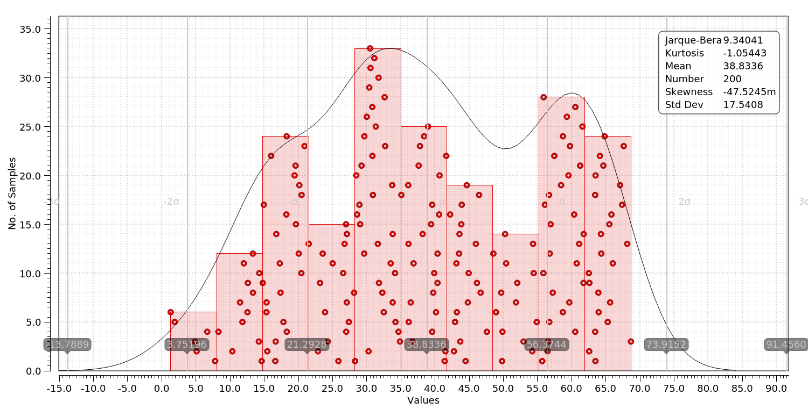
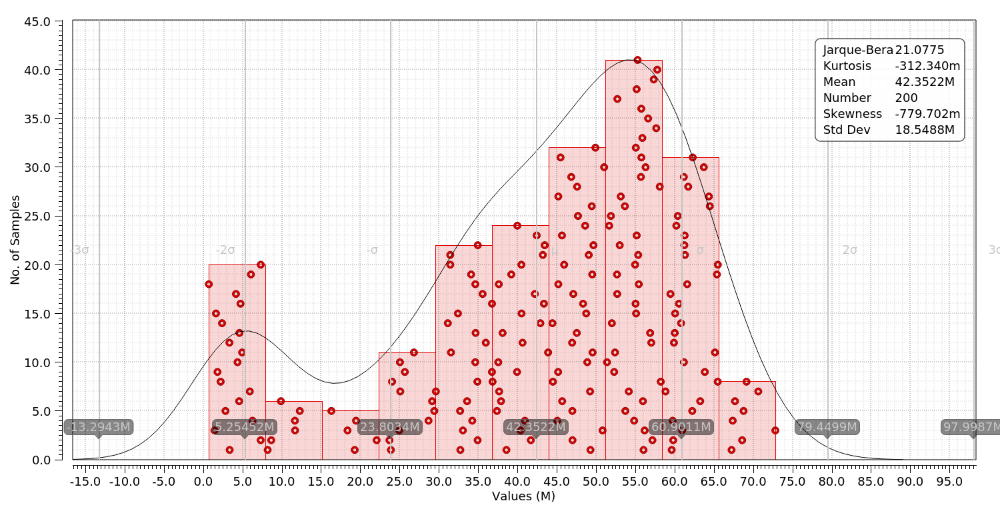
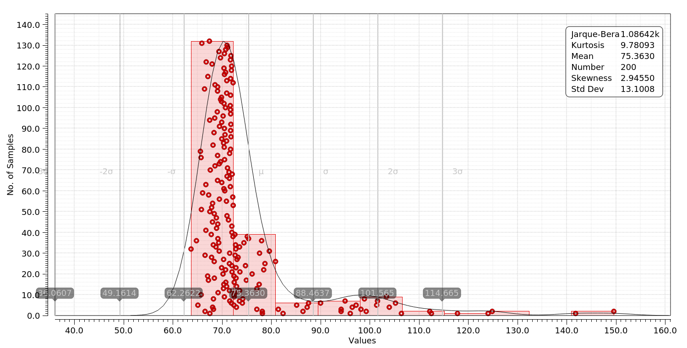
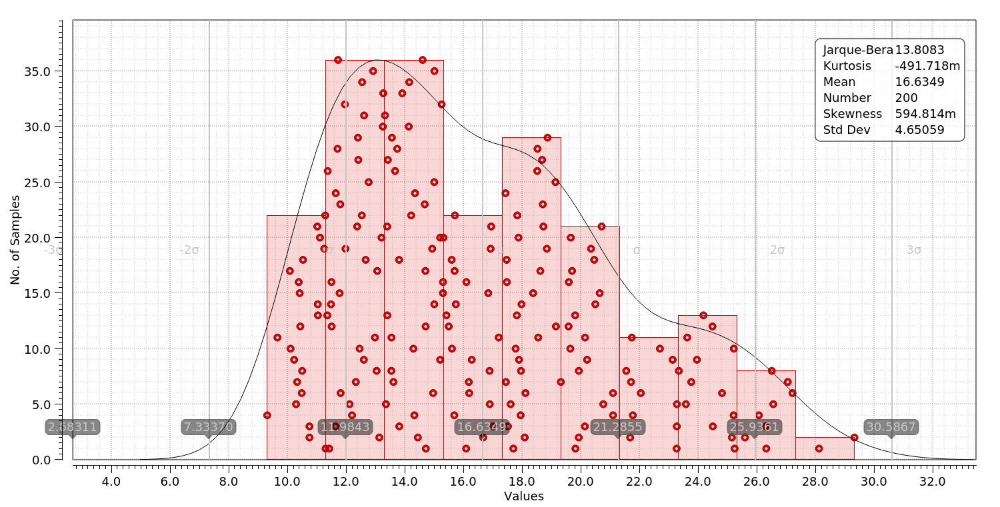

## 1.8 V Rail-to-Rail I/O OpAmp
___
### Features
* Realized in GPDK 45 nm CMOS process
* Folded cascode OTA topology
* 62 dB open-loop DC gain
* 58 MHz GBW (Miller compensated)
* 72&deg; phase margin
* 11 dB gain margin
* --287 uV input offset voltage

### Figures
#### Open-Loop Gain Frequency Response

#### Open-Loop Phase Frequency Response

#### Voltage Follower Frequency Response (10 kΩ || 100 pF load)

#### Voltage Follower Transient Response (10 kΩ || 100 pF load)

### Corners (at -40 and 125 &deg;C)
|                      | Min   | Nominal | Max   | TT (-40) | TT (125) | FF (-40) | FF (125) | SS (-40) | SS (125) | SF (-40) | SF (125) | FS (-40) | FF (125) |
|----------------------|-------|---------|-------|----------|----------|----------|----------|----------|----------|----------|----------|----------|----------|
| DC Gain (dB)         | 43.87 | 62.47   | 74.61 | 64.57    | 54.46    | 74.61    | 62.26    | 58.23    | 45.12    | 69.33    | 60.21    | 59.06    | 43.87    |
| GBW (MHz)            | 28.21 | 58.24   | 115.9 | 54.78    | 38.59    | 115.9    | 71.67    | 40.68    | 28.21    | 48.55    | 33.35    | 47.69    | 34.29    |
| Phase Margin (&deg;) | 69.95 | 71.71   | 77.13 | 74.95    | 74.98    | 69.95    | 70.86    | 76.12    | 76.27    | 76.66    | 76.72    | 77.13    | 76.8     |
| Gain Margin (dB)     | 6.0   | 10.85   | 15.48 | 11.03    | 12.75    | 6.0      | 9.131    | 13.95    | 15.48    | 10.8     | 12.87    | 11.52    | 14.07    |

### Monte Carlo (200 points)
#### Open-Loop DC Gain

#### GBW

#### Phase Margin

#### Gain Margin

### References
1. ["Design of a Rail-to-Rail Folded Cascode Amplifier with Transconductance Feedback Circuit", Radu Ciocoveanu et al.](https://www.researchgate.net/publication/305114271_Design_of_a_Rail-to-Rail_Folded_Cascode_Amplifier_with_Transconductance_Feedback_Circuit)